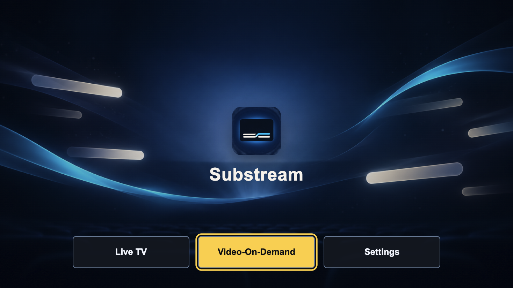

# Substream

Substream is an IPTV live TV and video-on-demand player for Samsung Tizen TVs and browsers. It supports M3U libraries, on-demand Xtream catalogues, TMDb details, OpenSubtitles downloads, local video files, local favourites, and playback resume.

Live TV currently requires an Xtream-compatible `get.php` source. It browses Finnish provider categories, shows available programme information, and plays embedded subtitles when the stream and device support them. The optional trusted-LAN companion service sends VOD selections and streams a selected browser file from the computer to a paired TV. The computer and companion service must stay available during computer-file playback on the TV. When enabled, browsers can also use it as a CORS bridge for the public Nordic guide; TV browsing and playback do not depend on it. See [Current behavior and architecture](docs/status.md#live-tv).



The UI and navigation are shared across platforms. Runtime ports select browser/Tizen adapters; companion control and subtitle relay routing have independent enablement. Mi Box support is deferred. See [shared architecture](docs/cross-platform-architecture.md).

## Features

- **Live TV:** browse Finnish Xtream categories, see current and next programme information, and play streams with embedded subtitles when the provider and device support them.
- **Tizen Multi-Sub subtitles:** personal TV builds automatically use the separate live subtitle relay for marked channels. Run it locally with `npm run relay:personal`; the Mac must stay awake. Hosted HTTPS playback was accepted on Tizen on 2026-10-03; see the relay operations guide for the last recorded deployment. For hosted playback the Mac relay is not needed.
- **VOD library:** browse and search M3U or Xtream movie and series catalogues, view TMDb details and artwork, and select episodes for playback. Series playback can continue to the next episode.
- **Local video files:** open one video from the browser without configuring IPTV, review filename-based details, then play on the computer or stage it for a paired TV. Release filenames with explicit season/episode markers automatically search OpenSubtitles in the preferred language. SRT/WebVTT subtitles can also be attached locally and shared with the active TV session. TV playback uses ffmpeg/ffprobe on the companion computer to prepare incompatible files as H.264 MP4 before streaming, preserving supported audio such as E-AC-3 5.1.
- **Playback and subtitles:** resume VOD playback, skip forward or back, adjust aspect mode, subtitle size and timing, and choose a preferred subtitle language.
- **Personal library:** save favourites and continue watching progress locally on the device.
- **Play on TV:** pair a browser with named TVs using one-time codes, choose a playback target, and send VOD selections or local media over the optional trusted-LAN companion service.
- **Finnish and English UI:** switch the app language in Settings.
- **Samsung Tizen and browsers:** use Tizen AVPlay on supported TVs and browser video playback on compatible devices.

## Start in a browser

Use Node.js 22.18+ (or a newer supported LTS) and npm. The inspection command needs Node's built-in TypeScript support.

```sh
npm install
npm run dev
```

Open the URL printed by Vite, add a playlist, and choose Live TV or Video-On-Demand. Add OpenSubtitles and TMDb credentials in Settings if needed. TMDb accepts a read access token (preferred) or API key.

Search is available in browser and TV profiles and works without companion pairing: import an M3U catalogue or refresh the full Xtream catalogue from Search. Cached titles remain searchable offline; playback still needs access to the provider.

## Personal development

Copy [`.env.example`](.env.example) to the ignored `.env`. Personal commands require `IPTV_M3U_URL`, `OPENSUBTITLES_API_KEY`, and either `TMDB_API_READ_ACCESS_TOKEN` or `TMDB_API_KEY`.

```sh
npm run dev:personal
```

This starts Vite with personal defaults and the trusted-LAN VOD/local-file companion; Ctrl+C stops both. The live subtitle relay is a separate process started with `npm run relay:personal`; `dev:personal` does not start it. Personal builds embed credentials in the client bundle. Anyone with the bundle can recover them: never share or commit personal builds, `.env`, playlist URLs, tokens, or signed media URLs. UI-entered configuration is stored locally on the device; it is not a secret vault.

Standard builds do not embed those credentials. The optional `COMPANION_SERVER_URL` address is embedded even in standard builds. Development proxies do not make client-supplied credentials secret; a distributed service needs a server-side design to protect them.

## Public static deployment

Use the public build for an internet-facing browser deployment:

```sh
npm run build:public
```

It always emits a static `dist/` directory, never starts the companion service, and ignores every `.env` package default. In particular, it does not embed `COMPANION_SERVER_URL`, playlist URLs, or OpenSubtitles/TMDb credentials. Deploy only `dist/`, never `scripts/companion-server.mjs` or any `/api/*` service.

The web server must reject `/api/` rather than routing it through the single-page-app fallback. Browser-entered credentials remain in that browser's local storage and are not a secure vault. Provider requests are made directly from the browser, so the provider will still receive its own request URLs and credentials.

## Common commands

| Command | Purpose |
| --- | --- |
| `npm run check` | Typecheck and run synthetic unit tests |
| `npm run build` | Browser output in `dist/` |
| `npm run build:tizen` | Tizen 3 web payload in `tizen/dist/` |
| `npm run build:tizen:6` | Tizen 6+ payload in the same directory |
| `npm run preview:chromium47` | Docker-based legacy UI preview; append `-- stop` to clean up |
| `npm run preview:chromium47:personal` | Preview with private `.env` defaults |
| `npm run inspect:m3u` | Fetch the configured private playlist and print a credential-safe summary |
| `npm run relay:personal` | Discover Multi-Sub channels and run the separate local subtitle relay using private `.env` / `.env.live-relay` |
| `npm run relay:test` | Synthetic relay protocol, server, decoder and client tests |
| `npm run relay:smoke` / `npm run relay:local` | Synthetic FFmpeg packaging / complete local relay pipeline checks |

Build commands also have `:personal` variants. See [package.json](package.json) for the complete script list. Tizen web builds are not signed installable packages.

## Guides

- [Current behavior](docs/status.md): supported features and remaining limitations.
- [Shared architecture](docs/cross-platform-architecture.md): runtime ports, ownership, optional services and refactor diagram.
- [Tizen setup and deployment](tizen/README.md): certificates, signing, installation, and troubleshooting.
- [Search and Play on TV](docs/companion-search.md): optional LAN relay and browser media compatibility.
- [Remote navigation](docs/navigation.md): keyboard/remote behavior and focus rules.
- [Verification](docs/verification.md): automated checks, legacy preview, and device smoke tests.
- [Embedded live subtitles](docs/live-dvb-subtitles.md): decoder limits and provider diagnostics.
- [Local-file playback](docs/local-file-playback.md): file ownership, subtitles, computer-to-TV streaming and limitations.
- [Live subtitle relay](docs/live-subtitle-relay.md): automatic Multi-Sub routing, local setup and recovery.
- [Subtitle relay deployment](docs/live-subtitle-relay-deployment.md): last recorded hosted setup, update workflow and validation.
- [Mi Box port plan](docs/mi-box-port-plan.md): deferred Android work; no APK exists.

TMDb supplies metadata and artwork; Substream is not endorsed or certified by TMDb. Keep the required TMDb attribution visible when distributing the app. OpenSubtitles is an external service; Substream is not affiliated with or endorsed by it.
