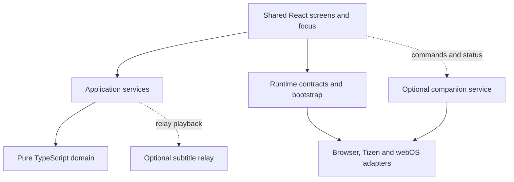

# Shared application architecture

The browser, Samsung Tizen and LG webOS apps share React screens, styles, navigation and TypeScript domain rules. Runtime wiring selects adapters and describes device capabilities. Android/Mi Box support is deferred; no Android shell, bridge, adapter or APK target exists.

## Structure

| Layer | Responsibility |
| --- | --- |
| `src/core` | Playlist classification/evidence, catalogue normalization/import, provider identities, live selection, subtitle rules and relay protocol/timing; no browser, React, Node, Tizen or webOS globals |
| `src/contracts` | Runtime capabilities, logical input, catalogue/preferences/transport ports and companion messages |
| `src/application` | Live playback routing/recovery, release coordination, companion lifecycle, live caches and provider search |
| `src/bootstrap` | Default runtime selection and settings facade preserving existing validation/storage keys |
| `src/app` | Shared screens, presentation, focus, editing, localization and remaining VOD orchestration |
| `src/platform` | HTML video, AVPlay, web storage, provider/service clients, Samsung/LG APIs and rendering |
| `services/live-subtitle-relay` | Separate Node service for single-source media packaging and DVB caption decoding |

`main.tsx` mounts `RuntimeProvider → CompanionProvider → App`. `createAppRuntime` supplies playback construction, a release barrier, independent catalogue sessions, preferences, transport and key registration. Overrides let tests or future hosts replace these services.

Platform identity (`browser`, `tizen` or `webos`) is separate from interaction profile (`desktop`, `touch` or `tv`). Bootstrap selects touch interaction for a coarse primary pointer without hover; TV navigation and deliberate text editing use the profile. Touch playback starts with controls hidden; tapping reveals navigation and playback actions, and Hide controls restores the unobstructed player. Touch navigation suppresses automatic row highlighting and simulated hover; keyboard input restores ordinary focus styling. Features use capabilities such as native video surfaces, local-file picking, direct guide requests, companion and relay support. Generic input normalization lives in `src/contracts/input.ts`; Samsung registration remains in its adapter.

Shared CSS retains Chromium 47 as the complete baseline: flexbox, static colours, physical positioning and explicit margins. See [navigation](navigation.md) and [verification](verification.md).

## What the refactor changed

| Before | Current ownership |
| --- | --- |
| Screens detected Tizen and constructed concrete players | Bootstrap selects the runtime; screens request players through a factory |
| Relay retry/fallback sequencing lived in `LiveTv` | `LivePlaybackController` owns routing, recovery and session cleanup |
| Playback cleanup was tied to one screen | A runtime-owned release barrier spans Live/VOD route lifetimes |
| Catalogue access was tied to the IndexedDB implementation | Repository factory opens independent sessions; callers close their own session |
| Settings and live caches accessed global storage from screens | Settings facade and cache helpers use injected preferences |
| Search implementation lived under companion integration | Shared search lives in `src/application/integrations`; TV exposes Search with D-pad editing |
| Companion connection/polling depended on VOD settings being mounted | App-level controller receives commands across Home, Live TV and VOD |

Compatibility re-exports retain older import paths where needed. IndexedDB schema/version and existing preference keys remain intact.

## Playback ownership

`PlaybackPlayerFactory` selects HTML video or AVPlay and optionally constructs relay playback. Its current surface request uses DOM elements because the shipped browser, Samsung and LG hosts are web runtimes. A native Android surface contract is still future work.

`LivePlaybackController` owns one live session, relay startup, up to two reconnect attempts after established playback and direct fallback. It releases the old session before replacement. Initial relay failure falls back after cleanup; unconfirmed cleanup blocks replacement. Changing channel or choosing Retry resets the recovery budget.

The HTML video adapter retries native network errors, fatal HLS network/media errors and transient client remux request failures up to three times per loaded source, with 1/2/4-second backoff. Native VOD reloads and remux recovery retain the current position; HLS resumes its existing session. Recovery stays in a buffering state until playback time advances, with the live/VOD startup deadline bounding each attempt even if Chromium retains stale buffered-data flags. Pause, source replacement and disposal cancel pending retries. Permanent native decode/unsupported-source and remux format/codec failures remain terminal. Retries retain the existing client transport and never introduce a credential-forwarding service.

Both screens use session guards to reject late callbacks and a shared `PlaybackReleaseBarrier` before acquiring a player. Disposal is bounded and idempotent while pending or successful. Failed disposal remains blocked until explicit retry succeeds. Server lease/demand expiry also releases abandoned relay ingest; the client must not assume immediate remote cleanup after disconnection.

VOD still owns subtitle search, resume, next-episode and much of its player UI orchestration. Live and VOD do not yet use one complete session controller. Engine-reported capabilities and broader native lifecycle handling remain future work; the current `playbackCapabilities` helper alone does not establish codec or track support.

## Device-owned data and requests

Client credential ownership is a mandatory architecture boundary. User-entered
provider, OpenSubtitles and TMDb credentials are stored on the device and sent
directly only to their intended provider/API. Hosting, access, companion and
subtitle-relay services must not collect, proxy or synchronize them. See the
[mandatory client credential policy](client-credential-policy.md) for scope,
review requirements, separate service authentication and HTTP security limits.

Catalogue sessions wrap the existing IndexedDB implementation. An interrupted import preserves the last ready generation, unknown entries retain classification evidence, and closing one session does not close another. Preferences preserve existing setting keys and denied-storage fallbacks. Provider/metadata/guide requests use injected transport where wired into the shared screens; some optional local-media clients still use their web adapters directly.

Search uses the device's imported M3U catalogue or account-scoped Xtream cache. It does not require pairing or a relay. The Xtream cache still loads/searches large record collections; indexed per-record storage, worker indexing and measured performance budgets remain separate work.

## Optional services and standalone use

| Feature | Required dependency |
| --- | --- |
| Installed UI, settings, saved catalogue, favourites/resume | Device assets and storage |
| Playlist import, live/VOD streaming and provider search refresh | Provider/network and supported media formats |
| TMDb/OpenSubtitles enrichment | Respective service and configured credentials |
| Companion commands / Play on TV | Enabled reachable companion and pairing |
| Computer-to-TV local media | Companion computer, staged media and supported preparation tools |
| Relayed Multi-Sub captions | Enabled configured subtitle relay |

The companion controller has disabled, connecting, available and unavailable states. Disabling its Settings switch stops background connection/polling and clears queued commands. It starts only in a supported TV profile with an enabled, configured endpoint; existing configured installations retain automatic connection unless disabled. Pairing reset aborts the active event poll before resetting the service, then resumes with sequence cursor zero so old in-flight events cannot conflict with the reset service sequence. Commands enter the shared VOD flow, and provider selections remain fingerprint-checked. See [companion setup](companion-search.md).

Relay enablement is independent. Disabled relay routing creates no relay session; ordinary provider browsing/playback remains usable without either helper. Finnish SkyShowtime 1/2 use the public Nordic replacement exclusively: Tizen and LG request it directly, hosted browsers use the fixed same-origin `/public/nordic-epg` endpoint, and development can use `/api/nordic-epg` or a configured companion bridge. Failure or an empty replacement leaves those channels without guide data; it does not request provider EPG or DNA. Other channels retain provider EPG and verified DNA enrichment. Guide requests omit credentials/referrers, have a 20-second download deadline, retry after failure and share a twelve-minute feed cache. Channel caches record replacement provenance, and the screen checks freshness every minute and on visibility resume.

Standalone operation requires no Substream server for ordinary provider use. Streaming still needs a network, and browser CORS/codec restrictions remain. Local files sent to a TV depend on the companion for that session. See [local-file playback](local-file-playback.md).

## Verification and deferred work

Architecture boundary tests protect the pure core and prevent screens from selecting concrete players/Tizen APIs. Synthetic tests cover runtime wiring, independent catalogue sessions, stored settings, optional-service disablement, injected companion transport, stale callbacks, failed cleanup/retry, relay fallback and Search focus. Hook-order checks guard route-loading transitions.

The 2026-10-04 refactor passed typechecking, the full test suite, browser/Tizen 3/Tizen 6 builds and a synthetic Chromium 47 Search navigation check with no runtime exceptions. The user subsequently reported installing a fresh personal TV package and encountering a relay startup fallback. A separate hosted diagnostic passed; post-refactor physical-TV playback acceptance remains pending. Previous hosted relay acceptance does not validate this refactor's AVPlay, remote timing or sleep/wake behavior. Follow [verification](verification.md) before release.

Further extraction of VOD orchestration, dynamic playback capabilities, native surface/network integration and measured device performance remain open. The [Mi Box plan](mi-box-port-plan.md) describes a possible future port using these boundaries; implementation has not started.

## LG webOS adapter

The LG port adds a `webos` platform identity while preserving the shared `tv`
interaction profile. Bootstrap gives Tizen detection precedence, then accepts
an injected `PalmSystem`, `webOS.platform.tv === true`, or the LG
`Web0S`/`WebOS` SmartTV `WebAppManager` user-agent signature. Merely loading
an SDK object in a desktop browser does not turn it into a TV. No vendor
webOSTV.js bundle is required for the implemented host boundary.

| Ownership | Source |
| --- | --- |
| Platform/profile and capability composition | [bootstrap/runtime.ts](../src/bootstrap/runtime.ts), [runtime contracts](../src/contracts/runtime.ts) |
| Host detection, platform Back, native keyboard visibility | [webOS runtime adapter](../src/platform/webos/runtime.ts) |
| Direct player selection; no relay factory | [webOS player factory](../src/platform/webos/player-factory.ts) |
| Hidden/visible player state and source restoration | [webOS HTML player](../src/platform/webos/html-video-player.ts), [lifecycle binding](../src/platform/webos/playback-lifecycle.ts) |
| Source teardown/resume hooks, HLS and remux behavior | [shared HTML player](../src/platform/browser/html-video-player.ts) |
| Manifest, isolated outputs and archive audit | [appinfo.json](../webos/appinfo.json), [webos.mjs](../scripts/webos.mjs), [Vite configuration](../vite.config.ts) |
| Unified LG/Tizen deployment dispatch | [deploy.mjs](../scripts/deploy.mjs) |

The default LG capabilities are explicit:

| Capability | LG value | Meaning |
| --- | --- | --- |
| `nativeVideoSurface` | `false` | Uses the shared HTML `<video>` surface, not AVPlay; this does not rule out native HLS decoding |
| `tvInput` | `true` | Standard TV keyboard events, including Back 461, need no Samsung key registration |
| `supportsLocalMediaPicker` | `false` | No browser-style file picker on the TV |
| `directGuideRequests` | `true` | Permits direct public-guide requests from the TV; provider/network availability remains best effort |
| `supportsCompanion` | `true` | Enables pairing, the app-scoped receiver and TV connection controls; TV storage/USB picking remains unavailable |
| `supportsLiveRelay` | `false` | No Samsung relay player or relay Settings controls |

### Playback and lifecycle

`WebOsPlaybackPlayerFactory` selects `WebOsHtmlVideoPlayer` only when the UI
supplies a video element. It reuses the shared native HTML/HLS, hls.js/MSE,
audio/text-track and client remux paths; actual formats, tracks, CORS and
byte-range behavior remain device/provider constraints. Native HLS is used
where the media element supports it and the shared subtitle mode permits it.
A declared MIME type or MSE availability is not a codec guarantee.

Each LG player binds `visibilitychange` and `pagehide`. Hiding saves the latest
local progress, invalidates pending callbacks, cancels retries/timers, releases
HLS/remux/DVB resources, pauses and detaches the source. Repeated background
events are coalesced. Loads and playback/seek commands issued while hidden
update a local snapshot instead of starting another source. Returning visible
restores requested playback; an explicitly paused source waits for Play.
Finite VOD or an explicit seek restores its logical position, including a
remux offset; live playback does not blindly restore a stale absolute playhead.
Destroy removes listeners and prevents the disposed instance from restarting.
The shared release barrier continues to protect route-to-route acquisition.
These paths have synthetic coverage; standby/firmware event behavior still
requires the physical checks in [verification](verification.md#lg-webos-physical-tv-check).

### Input, storage and build boundary

Shared input normalization maps LG Back 461 to `Back`. Screens use their
existing navigation/editing behavior. At Home, an open native keyboard gets
first opportunity to consume Back; otherwise the runtime invokes SDK platform
Back, injected `PalmSystem.platformBack`, or the documented app-close fallback.
The manifest disables LG history-based Back handling to avoid competing with
shared navigation. See [navigation](navigation.md).

Preferences use the existing localStorage facade, and catalogue sessions use
IndexedDB. Network requests use device-side fetch directly to the provider or
API. No LG backend, credential proxy, account synchronization or new storage
schema is introduced. Persistence across restart/reinstallation is a device
acceptance question, not a guarantee implied by the API.

The clean build targets Chromium 120, disables the legacy bundle for that
artifact, ignores `.env` defaults and strips `VITE_*` variables. Personal
commands use the existing client-default embedding path in separate ignored
output directories. LG deployment settings are not compiled into app assets;
LG CLI subprocesses receive only the runtime environment allowlist. Shared
CSS retains the complete Chromium 47 baseline. Setup, artifact handling and
troubleshooting belong in [the LG guide](../webos/README.md); the
[port status](lg-webos-port-plan.md) records confirmed and pending acceptance.
