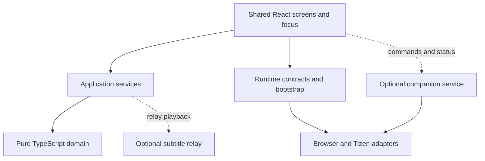

# Shared application architecture

The browser and Samsung Tizen apps share React screens, styles, navigation and TypeScript domain rules. Runtime wiring selects adapters and describes device capabilities. Android/Mi Box support is deferred; no Android shell, bridge, adapter or APK target exists.

## Structure

| Layer | Responsibility |
| --- | --- |
| `src/core` | Playlist classification/evidence, catalogue normalization/import, provider identities, live selection, subtitle rules and relay protocol/timing; no browser, React, Node or Tizen globals |
| `src/contracts` | Runtime capabilities, logical input, catalogue/preferences/transport ports and companion messages |
| `src/application` | Live playback routing/recovery, release coordination, companion lifecycle, live caches and provider search |
| `src/bootstrap` | Default runtime selection and settings facade preserving existing validation/storage keys |
| `src/app` | Shared screens, presentation, focus, editing, localization and remaining VOD orchestration |
| `src/platform` | HTML video, AVPlay, web storage, provider/service clients, Samsung APIs and rendering |
| `services/live-subtitle-relay` | Separate Node service for single-source media packaging and DVB caption decoding |

`main.tsx` mounts `RuntimeProvider → CompanionProvider → App`. `createAppRuntime` supplies playback construction, a release barrier, independent catalogue sessions, preferences, transport and key registration. Overrides let tests or future hosts replace these services.

Platform identity (`browser` or `tizen`) is separate from interaction profile (`desktop` or `tv`). TV navigation and deliberate text editing use the profile. Features use capabilities such as native video surfaces, local-file picking, direct guide requests, companion and relay support. Generic input normalization lives in `src/contracts/input.ts`; Samsung registration remains in its adapter.

Shared CSS retains Chromium 47 as the complete baseline: flexbox, static colours, physical positioning and explicit margins. See [navigation](navigation.md) and [verification](verification.md).

## What the refactor changed

| Before | Current ownership |
| --- | --- |
| Screens detected Tizen and constructed concrete players | Bootstrap selects the runtime; screens request players through a factory |
| Relay retry/fallback sequencing lived in `LiveTv` | `LivePlaybackController` owns routing, recovery and session cleanup |
| Playback cleanup was tied to one screen | A runtime-owned release barrier spans Live/VOD route lifetimes |
| Catalogue access was tied to the IndexedDB implementation | Repository factory opens independent sessions; callers close their own session |
| Settings and live caches accessed global storage from screens | Settings facade and cache helpers use injected preferences |
| Search implementation lived under companion integration | Shared search lives in `src/application/integrations`; TV exposes Search with D-pad editing |
| Companion connection/polling depended on VOD settings being mounted | App-level controller receives commands across Home, Live TV and VOD |

Compatibility re-exports retain older import paths where needed. IndexedDB schema/version and existing preference keys remain intact.

## Playback ownership

`PlaybackPlayerFactory` selects HTML video or AVPlay and optionally constructs relay playback. Its current surface request uses DOM elements because both shipped hosts are web runtimes. A native Android surface contract is still future work.

`LivePlaybackController` owns one live session, relay startup, up to two reconnect attempts after established playback and direct fallback. It releases the old session before replacement. Initial relay failure falls back after cleanup; unconfirmed cleanup blocks replacement. Changing channel or choosing Retry resets the recovery budget.

Both screens use session guards to reject late callbacks and a shared `PlaybackReleaseBarrier` before acquiring a player. Disposal is bounded and idempotent while pending or successful. Failed disposal remains blocked until explicit retry succeeds. Server lease/demand expiry also releases abandoned relay ingest; the client must not assume immediate remote cleanup after disconnection.

VOD still owns subtitle search, resume, next-episode and much of its player UI orchestration. Live and VOD do not yet use one complete session controller. Engine-reported capabilities and broader native lifecycle handling remain future work; the current `playbackCapabilities` helper alone does not establish codec or track support.

## Device-owned data and requests

Client credential ownership is a mandatory architecture boundary. User-entered
provider, OpenSubtitles and TMDb credentials are stored on the device and sent
directly only to their intended provider/API. Hosting, access, companion and
subtitle-relay services must not collect, proxy or synchronize them. See the
[mandatory client credential policy](client-credential-policy.md) for scope,
review requirements, separate service authentication and HTTP security limits.

Catalogue sessions wrap the existing IndexedDB implementation. An interrupted import preserves the last ready generation, unknown entries retain classification evidence, and closing one session does not close another. Preferences preserve existing setting keys and denied-storage fallbacks. Provider/metadata/guide requests use injected transport where wired into the shared screens; some optional local-media clients still use their web adapters directly.

Search uses the device's imported M3U catalogue or account-scoped Xtream cache. It does not require pairing or a relay. The Xtream cache still loads/searches large record collections; indexed per-record storage, worker indexing and measured performance budgets remain separate work.

## Optional services and standalone use

| Feature | Required dependency |
| --- | --- |
| Installed UI, settings, saved catalogue, favourites/resume | Device assets and storage |
| Playlist import, live/VOD streaming and provider search refresh | Provider/network and supported media formats |
| TMDb/OpenSubtitles enrichment | Respective service and configured credentials |
| Companion commands / Play on TV | Enabled reachable companion and pairing |
| Computer-to-TV local media | Companion computer, staged media and supported preparation tools |
| Relayed Multi-Sub captions | Enabled configured subtitle relay |

The companion controller has disabled, connecting, available and unavailable states. Disabling its Settings switch stops background connection/polling and clears queued commands. It starts only in a supported TV profile with an enabled, configured endpoint; existing configured installations retain automatic connection unless disabled. Commands enter the shared VOD flow, and provider selections remain fingerprint-checked. See [companion setup](companion-search.md).

Relay enablement is independent. Disabled relay routing creates no relay session; ordinary provider browsing/playback remains usable without either helper. Guide enrichment is best effort: Tizen requests the public Nordic guide directly, and an enabled browser companion may bridge that public feed. Guide failure falls back to provider data.

Standalone operation requires no Substream server for ordinary provider use. Streaming still needs a network, and browser CORS/codec restrictions remain. Local files sent to a TV depend on the companion for that session. See [local-file playback](local-file-playback.md).

## Verification and deferred work

Architecture boundary tests protect the pure core and prevent screens from selecting concrete players/Tizen APIs. Synthetic tests cover runtime wiring, independent catalogue sessions, stored settings, optional-service disablement, injected companion transport, stale callbacks, failed cleanup/retry, relay fallback and Search focus. Hook-order checks guard route-loading transitions.

The 2026-10-04 refactor passed typechecking, the full test suite, browser/Tizen 3/Tizen 6 builds and a synthetic Chromium 47 Search navigation check with no runtime exceptions. The user subsequently reported installing a fresh personal TV package and encountering a relay startup fallback. A separate hosted diagnostic passed; post-refactor physical-TV playback acceptance remains pending. Previous hosted relay acceptance does not validate this refactor's AVPlay, remote timing or sleep/wake behavior. Follow [verification](verification.md) before release.

Further extraction of VOD orchestration, dynamic playback capabilities, native surface/network integration and measured device performance remain open. The [Mi Box plan](mi-box-port-plan.md) describes a possible future port using these boundaries; implementation has not started.
